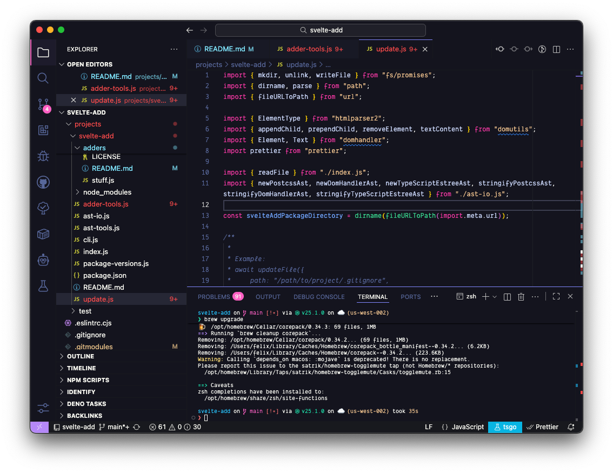
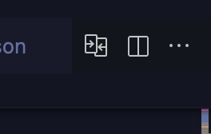
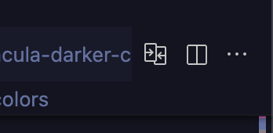

# Dracula Darkest Theme for Visual Studio Code 🧛🏻‍♂️

> This Theme based on [dracula-official](https://github.com/dracula/dracula-theme) 🙏



> This fork adds "Evondev Dracula **Darker minus 1** Contrast New Color" theme based on "Dracula Darker Contrast New Color" which lowers the (HSL) luminance of backgrounds from 11 to 10 (wow 🤯)

## Installation

1. Clone repository

```sh
git clone git@github.com:shiftgeist/evondev-dracula-darker.git
```

2. Package and install extension

```sh
npx vsce package && code --install-extension ./dracula-high-contrast-darker-0.2.89-darker.vsix
```

3. In the extension tab: Select `Restart Extensions`

4. Open command pallet and select `> Preferences: Color Theme`

## Fork Fixes

- [x] Same tab bar background gray -> dark purple

<div style="display: flex;">





</div>

- [ ] Add updated screenshot

## Fork Version

This fork aims to be one the same version but under the `-darker` prefix as evondev's.

## Scheme color

- Evondev Dracula Darker minus 1 Contrast New Color 🚀

## Evondev's settings.json

[Settings Json](https://github.com/evondev/evondev-dracula/blob/master/evondev-settings.json)

## Evondev's other extensions

- [Evondev Snippets](https://marketplace.visualstudio.com/items?itemName=evondev.evondev-snippets)
- [Evondev - HTML to CSS Class](https://marketplace.visualstudio.com/items?itemName=evondev.generate-css-class)
- [Evondev - Indent Rainbow Palettes](https://marketplace.visualstudio.com/items?itemName=evondev.indent-rainbow-palettes)

## Evondev's Font

[SF Mono Ligatures](https://github.com/kube/sf-mono-ligaturized).
